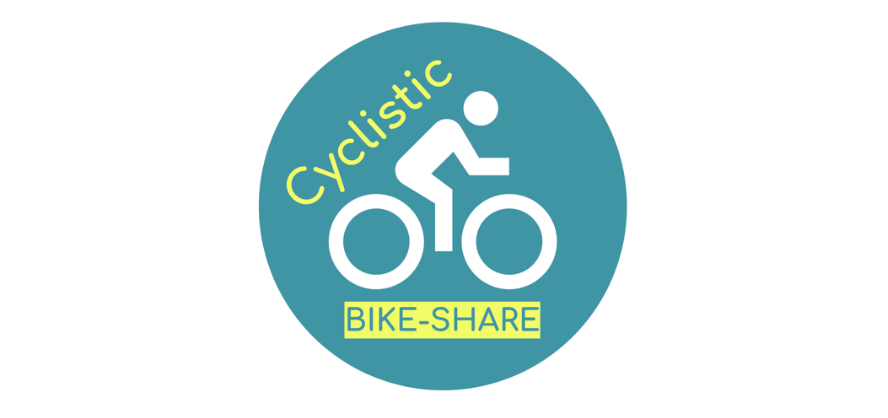

# CyclisticCaseStudy

Welcome!

This is my capstone project for the _Google Data Analytics Certificate_. It is my first case study project and is required by _Google_ in order to obtain my certificate.I will dive deep into a new Bike-share company's historical trip data of all their users for six months.

You can view my analysis here: [Cyclistic](https://htmlpreview.github.io/?https://github.com/MarcellaHarr/marcellaharris.github.io/blob/d8e8429635aa01d639a4e7d5d597560828b69ee9/Google%20Capstone%20Project/cylisticCaseStudy.html)

As well as my slide presentation here: [Presentation](https://github.com/MarcellaHarr/google-cyclistic_casestudy/blob/main/CyclisticCaseStudy/docs/Cyclistic%20Case%20Study%20Marketing%20Analysis%20Presentation.pdf)

Thank you for visiting!